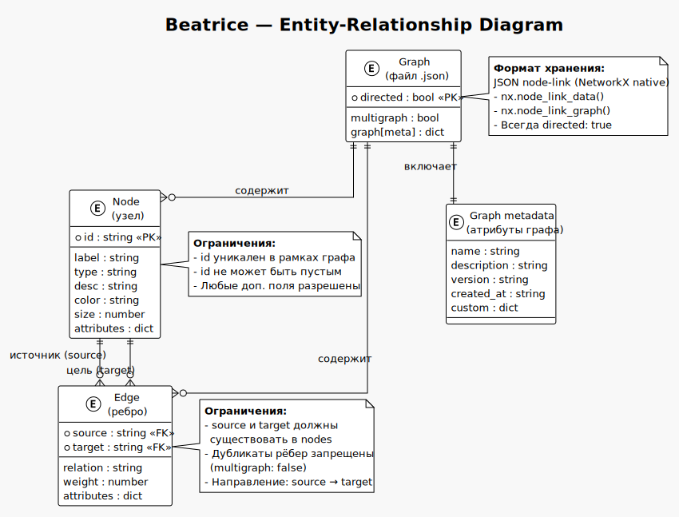

# Модель данных Beatrice

> Формат хранения графов: JSON node-link (NetworkX native).

---

## Общая структура

Файл `.json` содержит ровно 4 ключа на верхнем уровне. Формат — стандартный `nx.node_link_data()` / `nx.node_link_graph()`.

```json
{
  "directed": true,
  "multigraph": false,
  "graph": {},
  "nodes": [ ... ],
  "edges": [ ... ]
}
```

| Поле | Тип | Обязательное | Описание |
|---|---|---|---|
| `directed` | `bool` | да | Направленный граф (`true`) или неориентированный (`false`). В Beatrice всегда `true` |
| `multigraph` | `bool` | да | Разрешены ли несколько рёбер между одной парой узлов. В Beatrice всегда `false` — мультиграфы не поддерживаются |
| `graph` | `dict` | да | Мета-атрибуты графа (название, описание, версия и т.д.) |
| `nodes` | `list[dict]` | да | Список узлов |
| `edges` | `list[dict]` | да | Список рёбер |



---

## Узел (node)

```json
{
  "id": "Kafka",
  "label": "Kafka",
  "type": "брокер",
  "desc": "Распределённый event streaming",
  "color": "#FF6B6B",
  "size": 20
}
```

### Поля

| Поле | Тип | Обязательное | Описание |
|---|---|---|---|
| `id` | `string` | **да** | Уникальный идентификатор узла. Ключ в NetworkX. Не может быть пустым. |
| `label` | `string` | нет | Отображаемое имя узла. Если не указан, показывается `id`. |
| `type` | `string` | нет | Категория / тип узла (например: «брокер», «сервис», «БД»). |
| `desc` | `string` | нет | Описание узла (заметка, аннотация). |
| `color` | `string` | нет | Цвет узла в hex-формате (`#FF6B6B`). Используется в HTML-визуализации. |
| `size` | `number` | нет | Радиус узла в пикселях для визуализации. |

### Произвольные атрибуты

Узел может содержать любые дополнительные поля — модель не ограничивает набор атрибутов.

Пример:
```json
{
  "id": "PostgreSQL",
  "label": "PostgreSQL",
  "type": "БД",
  "desc": "Реляционная СУБД",
  "color": "#336791",
  "size": 22,
  "version": "16.2",
  "port": 5432
}
```

---

## Ребро (edge)

```json
{
  "source": "Kafka",
  "target": "ZooKeeper",
  "relation": "использует",
  "weight": 1.0
}
```

### Поля

| Поле | Тип | Обязательное | Описание |
|---|---|---|---|
| `source` | `string` | **да** | ID узла-источника. Должен существовать в `nodes`. |
| `target` | `string` | **да** | ID узла-цели. Должен существовать в `nodes`. |
| `relation` | `string` | нет | Тип / название связи (например: «использует», «содержит», «зависит от»). |
| `weight` | `number` | нет | Вес ребра (по умолчанию 1.0). |

### Произвольные атрибуты

Ребро также может содержать любые дополнительные поля.

Пример:
```json
{
  "source": "APIService",
  "target": "Database",
  "relation": "подключается к",
  "weight": 0.8,
  "protocol": "TCP/5432",
  "latency_ms": 5
}
```

---

## Чтение и запись

```python
import json, networkx as nx
from pathlib import Path

# Чтение: JSON → NetworkX DiGraph
data = json.loads(Path("graph.json").read_text(encoding="utf-8"))
G = nx.node_link_graph(data, directed=True, multigraph=False)

# Мутация
G.add_node("Redis", label="Redis", type="БД", desc="In-memory cache")
G.add_edge("Kafka", "Redis", relation="использует для кэша")

# Запись: NetworkX DiGraph → JSON
data = nx.node_link_data(G)
Path("graph.json").write_text(
    json.dumps(data, ensure_ascii=False, indent=2),
    encoding="utf-8"
)
```

---

## Ограничения

| Ограничение | Причина |
|---|---|
| **Только направленные графы** | `directed: true` зафиксировано в `load_graph()`. Неориентированные графы не поддерживаются. |
| **Нет мультиграфов** | `multigraph: false`. CLI проверяет дубликаты рёбер. |
| **id уникален** | Если добавить узел с существующим id, NetworkX перезапишет атрибуты старого. CLI предупреждает о дубликатах. |
| **Нет гиперрёбер** | Ребро соединяет ровно два узла. NetworkX не поддерживает рёбра на три и более узла. |
| **Нет вложенных узлов** | Не поддерживается группировка узлов в подграфы. |
| **JSON в памяти целиком** | Весь файл читается в память. Для графов > 100K узлов может потребоваться потоковая обработка. |

---

## Пример полного файла

```json
{
  "directed": true,
  "multigraph": false,
  "graph": {
    "name": "Kafka Knowledge Graph",
    "description": "Архитектура Apache Kafka",
    "version": "1.0"
  },
  "nodes": [
    {"id": "Kafka",   "label": "Kafka",        "type": "брокер",    "desc": "Event streaming"},
    {"id": "ZooKeeper", "label": "ZooKeeper",  "type": "координатор", "desc": "Кластер"},
    {"id": "Topic",   "label": "Topic",         "type": "структура", "desc": "Очередь"}
  ],
  "edges": [
    {"source": "Kafka", "target": "ZooKeeper", "relation": "использует"},
    {"source": "Kafka", "target": "Topic",     "relation": "содержит"}
  ]
}
```

---

## Связанные документы

- [ER-диаграмма](data-model.svg) — визуальная схема отношений сущностей (PlantUML)
- [Исходник диаграммы](data-model.puml) — PlantUML source
- [ADR: Архитектура](../ADR-graph-knowledge-architecture.md) — обоснование выбора формата и движка
- [README](../README.md) — документация CLI
- [PLAN.md](../PLAN.md) — планы развития
